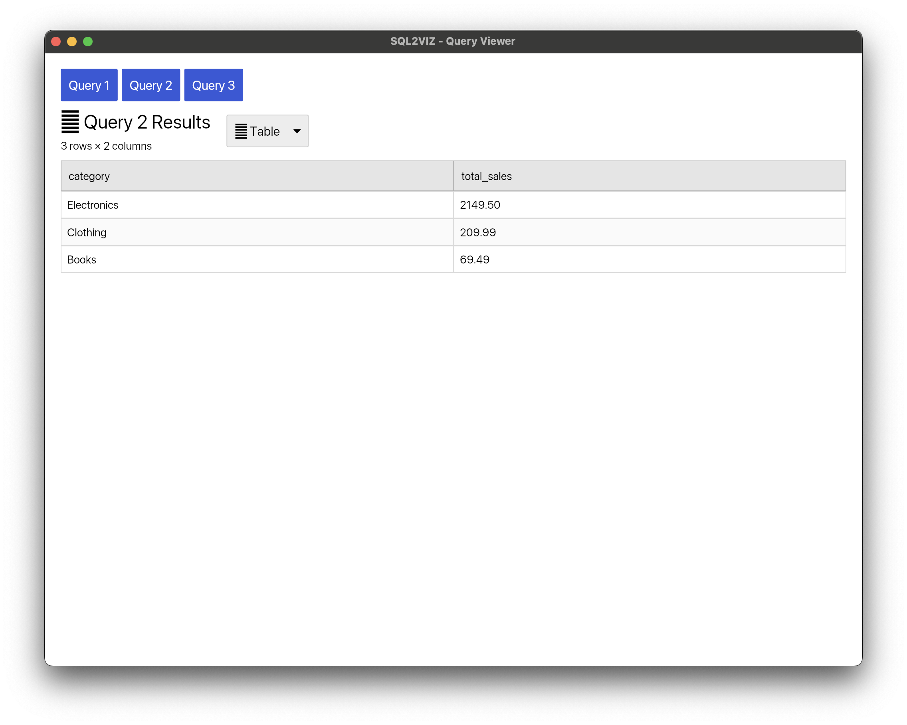
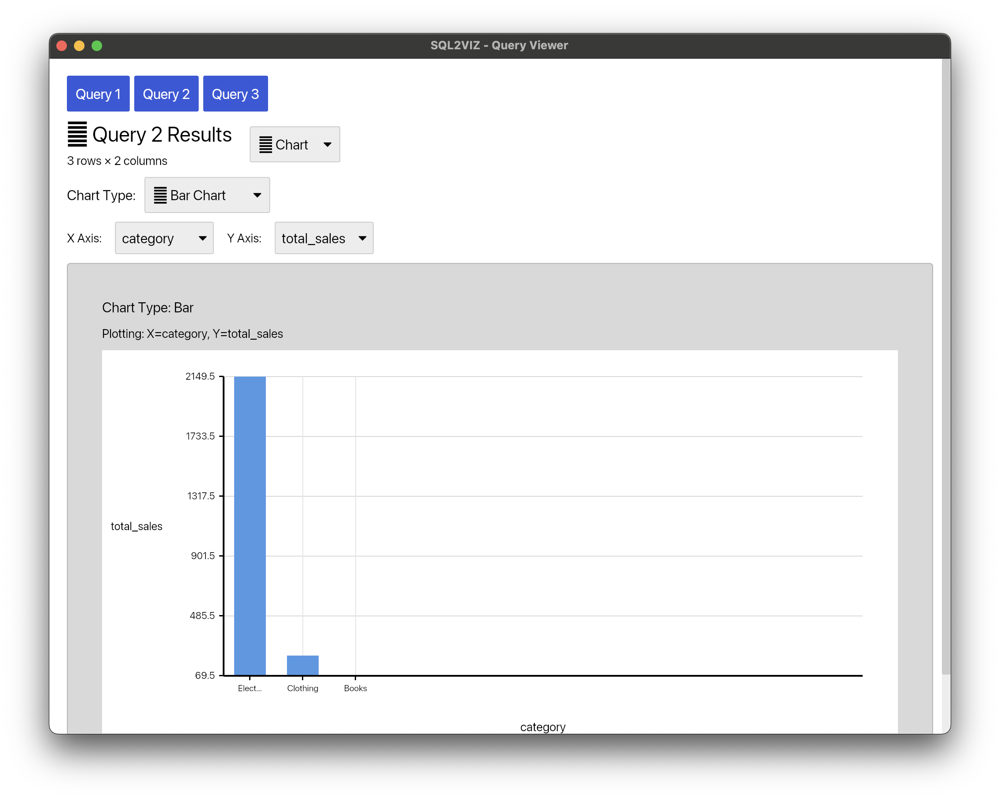
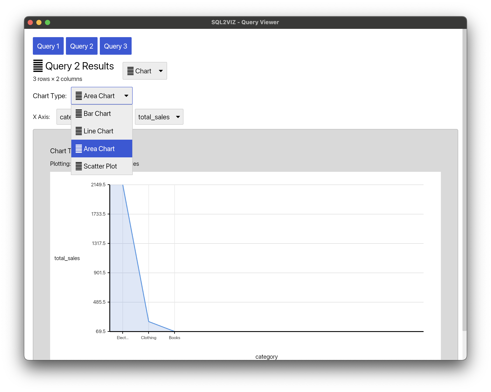

# sql2viz

Transform Raw SQL queries into visualizations using DuckDB and Iced. Available for Rust, Python, and WebAssembly.

## Installation

### Rust (via crates.io)

```toml
[dependencies]
sql2viz = { version = "0.2.0", features = ["gui"] }
```

### Python (via PyPI)

```bash
pip install sql2viz
```

### JavaScript/WASM (via npm)

```bash
npm install @nkwork9999/sql2viz-wasm
```

## Usage

### Rust

```rust
use sql2viz::vizcreate;

fn main() {
    let query = "SELECT 'A' as x, 10 as y UNION ALL SELECT 'B', 20";
    vizcreate(query.to_string()).unwrap();
}
```

#### Example with Database and CSV

```rust
use sql2viz::vizcreate;

fn main() {
    let queries = "
-- Connect to existing database
ATTACH 'mydata.db' AS mydb;

-- Query 1: Sales summary by category
SELECT category, SUM(amount) as total_sales
FROM mydb.sales
GROUP BY category
ORDER BY total_sales DESC;

-- Query 2: Load CSV file
SELECT * FROM 'test.csv' LIMIT 100;
";

    vizcreate(queries.to_string()).unwrap();
}
```

#### Using VizBuilder for Custom Charts

```rust
use sql2viz::{VizBuilder, ChartType};

fn main() -> Result<(), Box<dyn std::error::Error>> {
    VizBuilder::new()
        .add_query("SELECT month, sales FROM data")
        .with_chart(ChartType::Line, "month", "sales")
        .launch()?;
    Ok(())
}
```

### Python

**Method 1: Direct SQL**

```python
from sql2viz import vizcreate

# Simple query
vizcreate("SELECT * FROM 'data.csv'")

# Multiple queries
vizcreate("""
SELECT category, COUNT(*) as count
FROM products
GROUP BY category;

SELECT month, revenue
FROM sales
ORDER BY month;
""")
```

**Method 2: DuckDB Integration**

```python
import duckdb

# Simple usage
duckdb.sql("SELECT * FROM 'sales.csv'").viz()

# With chart configuration
duckdb.sql("SELECT month, revenue FROM sales").viz(
    chart_type="Line",
    x_column="month",
    y_column="revenue"
)
```

**Method 3: Using VizBuilder**

```python
from sql2viz import VizBuilder

builder = VizBuilder()
builder.add_query("SELECT month, sales FROM data")
builder.with_chart("Bar", "month", "sales")
builder.launch()
```

**Available chart types:** `"Bar"`, `"Line"`, `"Area"`, `"Scatter"`

### JavaScript/WASM

```html
<!DOCTYPE html>
<html>
  <head>
    <meta charset="UTF-8" />
    <title>SQL2VIZ Example</title>
  </head>
  <body>
    <canvas id="chart" width="800" height="600"></canvas>

    <script type="module">
      import init, {
        WasmVizBuilder,
      } from "https://unpkg.com/@nkwork9999/sql2viz-wasm@0.2.0/sql2viz.js";

      async function run() {
        await init();

        const canvas = document.getElementById("chart");
        const builder = new WasmVizBuilder();
        builder.setTitle("Sales Data");
        builder.setChartType("bar");

        const data = {
          column_names: ["Month", "Sales"],
          rows: [
            ["January", "150"],
            ["February", "230"],
            ["March", "180"],
          ],
        };

        builder.renderChart(canvas, data);
      }

      run();
    </script>
  </body>
</html>
```

**Chart types:** `"bar"`, `"line"`, `"pie"`, `"scatter"`

## Screenshots







## Features

### Core Features

- SQL query execution with DuckDB
- Interactive charts (Bar, Line, Area, Scatter, Pie)
- Table view with alternating row colors
- Multiple query tabs
- Column selection for chart axes
- CSV, Parquet, JSON file support

### Rust Features

- `gui`: Enable GUI visualization with Iced
- `python`: Python bindings via PyO3
- `wasm`: WebAssembly support

```toml
# GUI only
sql2viz = { version = "0.2.0", features = ["gui"] }

# Python bindings
sql2viz = { version = "0.2.0", features = ["python"] }

# WASM
sql2viz = { version = "0.2.0", features = ["wasm"] }
```

## Platform Support

| Platform | Rust | Python | WASM |
| -------- | ---- | ------ | ---- |
| Windows  | ✅   | ✅     | ✅   |
| macOS    | ✅   | ✅     | ✅   |
| Linux    | ✅   | ✅     | ✅   |
| Web      | ❌   | ❌     | ✅   |

## Links

- **Rust Crate**: https://crates.io/crates/sql2viz
- **Python Package**: https://pypi.org/project/sql2viz/
- **WASM Package**: https://www.npmjs.com/package/@nkwork9999/sql2viz-wasm
- **GitHub Repository**: https://github.com/nkwork9999/sql2viz
- **Documentation**: https://docs.rs/sql2viz

## License

- MIT License ([LICENSE-MIT](LICENSE-MIT) or http://opensource.org/licenses/MIT)
